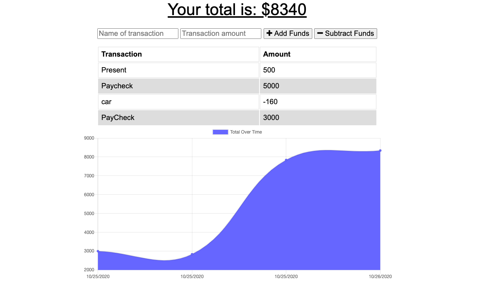

# Budget Tracker

## Description
A PWA application that allows users to track their spending and see their budget online as well as offline

## Table of Contents
* [Description](#Description)
* [Installation](#Installation)
* [Usage](#Usage)
* [License](#License)
* [Contributing](#Contributing)
* [Test](#Tests)
* [Questions](#Questions)

## Installation

## Usage
The application uses caches to allow users to access their budget spending with offline functionality 

## ILicense
MIT

## Contributing
Better styling for a better experience while using the app

## Testing
Run the application, enter budget information and then while disconnected from the server, continue to submit spending information to ensure functionality 

## Questions
- [GitHub](https://github.com/CodyBonsma)
- [Email](codybonsma@gmail.com)